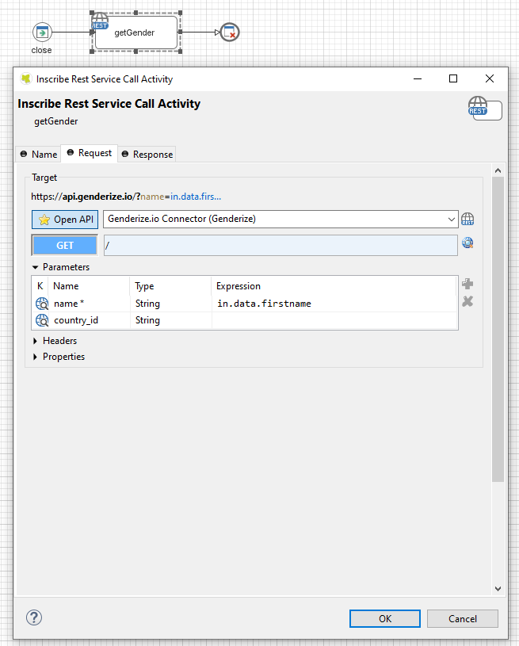
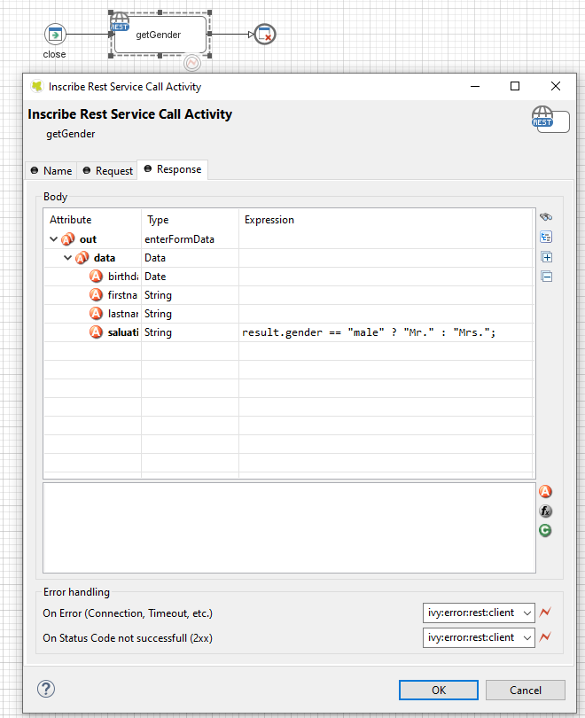
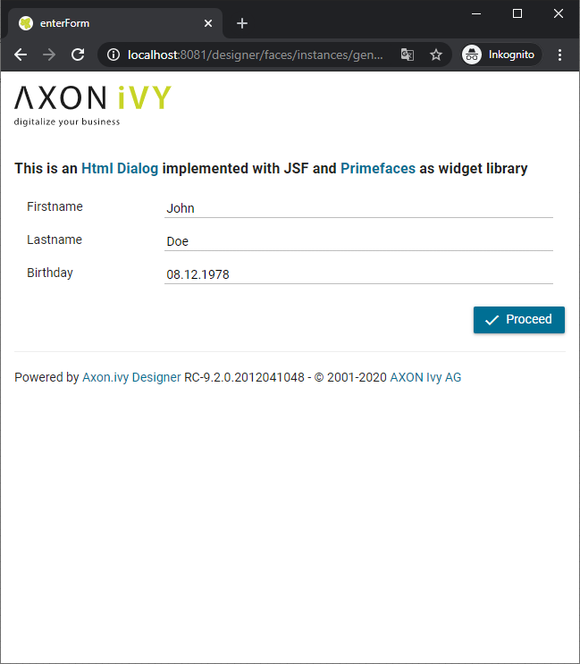
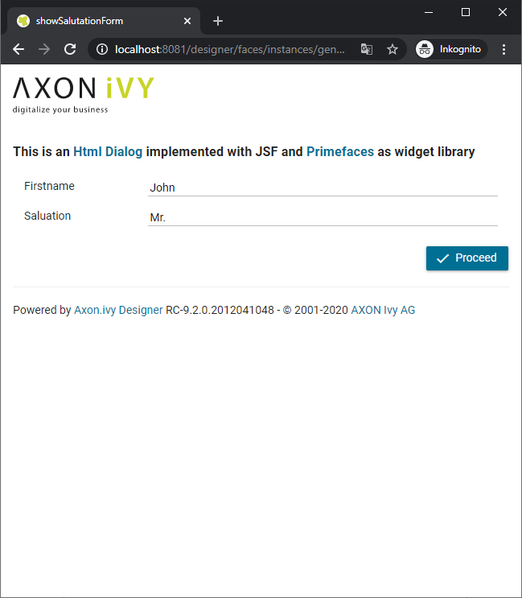

# Genderize.io Connector

Axon Ivy's [genderize.io](https://genderize.io) connector gives you access to a powerful API that returns the likely gender of that
name to output the probable gender of the name bearer(s).

This connector supports three different uses:
- A simple determination of the gender based on the name
- batch use for up to 10 names at once
- and a classification of the gender in the context of a specific country (e.g. "Andrea" usually has a female connotation in Germany and a male connotation in Italy).

## Demo

With this connector a demo process will be installed to demonstrate a simple use
case that determines the gender of a person and automatically adds the
salutation property to the process data.

API call

Result mapping

Example: Input Form

Example: Result Form

