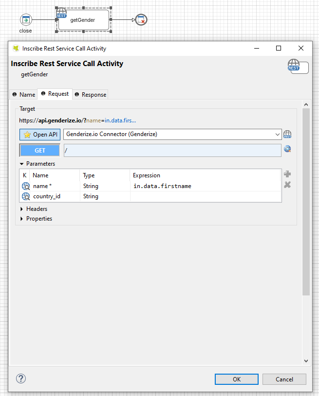
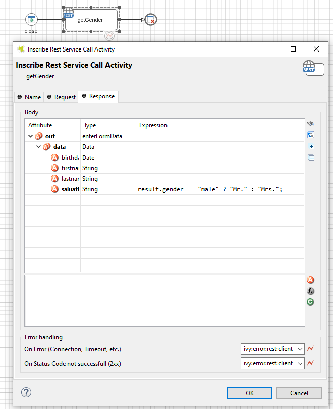
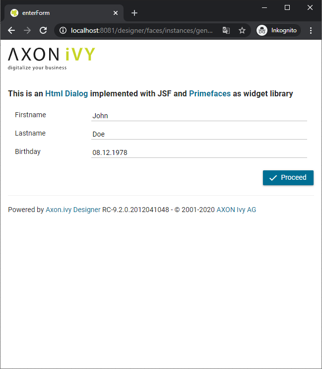
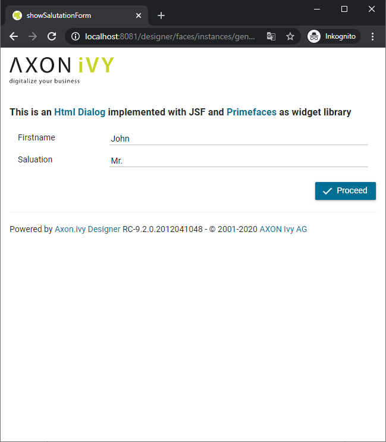

# Genderize.io Anschluss

#Axon Efeus [genderize.io](https://genderize.io) Anschluss gibt du greifst zu zu
ein kraftvolles API jene Rückgaben das wahrscheinliche Geschlecht von jenem
Namen zu ausgeben das mutmaßliche Geschlecht von den Name Inhaber(s).

Diese Anschluss Unterstützungen drei verschiedene Nutzungen:
- Ein simpler Entschluss von dem Geschlecht gegründet auf dem Namen
- Schub Nutzung für bis 10 Namen sofort
- Und eine Einordnung von dem Geschlecht in dem Kontext von einem spezifischen
  Land (gewöhnlich "#z.B." Andrea hat einen weiblichen Beiklang in Deutschland
  und einen männlichen Beiklang in Italien).

## Demo

Mit diesem Anschluss ein Demo Arbeitsgang will sein installiert zu demonstrieren
eine simple Nutzung Fall ermittelt jener das Geschlecht von einer Person und
automatisch fügt zu den Anrede Besitz zu #der Arbeitsgang #Daten.

API Anruf

Resultat Vermessung

Beispiel: #Einlesen #Formen

Beispiel: #Resultieren #Formen

