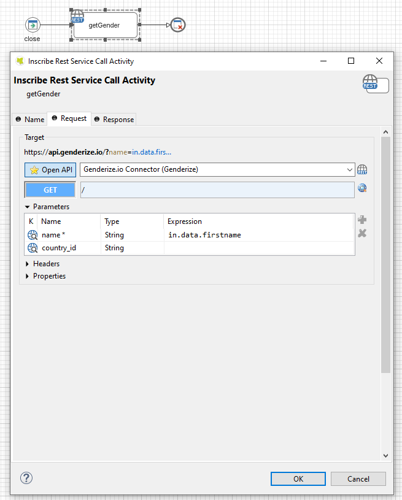
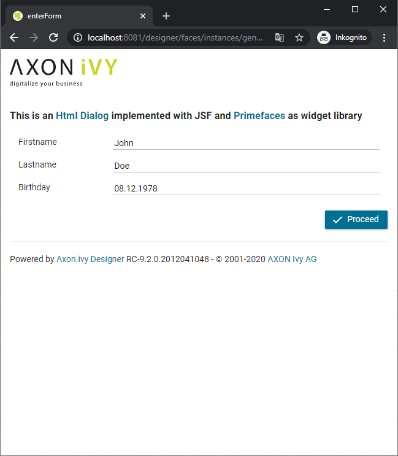

# Genderize.io Konnektor

Axon Ivy's [genderize.io](https://genderize.io) Konnektor  gibt dir Zugang zu einer leistungsstarken API, die anhand des
Namens das wahrscheinliche Geschlecht dieses/r Namensträger:In ausgibt.

Dieser Konnektor unterstützt drei verschiedene Verwendungsmöglichkeiten:
- Eine einfache Bestimmung des Geschlechtes anhand des Namens
- eine Batch-Nutzung für bis zu 10 Namen auf einmal
-  und eine Klassifizierung des Geschlechts im Kontext eines bestimmten Landes (z.B. ist "Andrea" in Deutschland meistens weiblich, in Italien meistens männlich konnotiert).

## Demo

With this connector a demo process will be installed to demonstrate a simple use
case that determines the gender of a person and automatically adds the
salutation property to the process data.

API call

Result mapping

Example: Input Form

Example: Result Form

